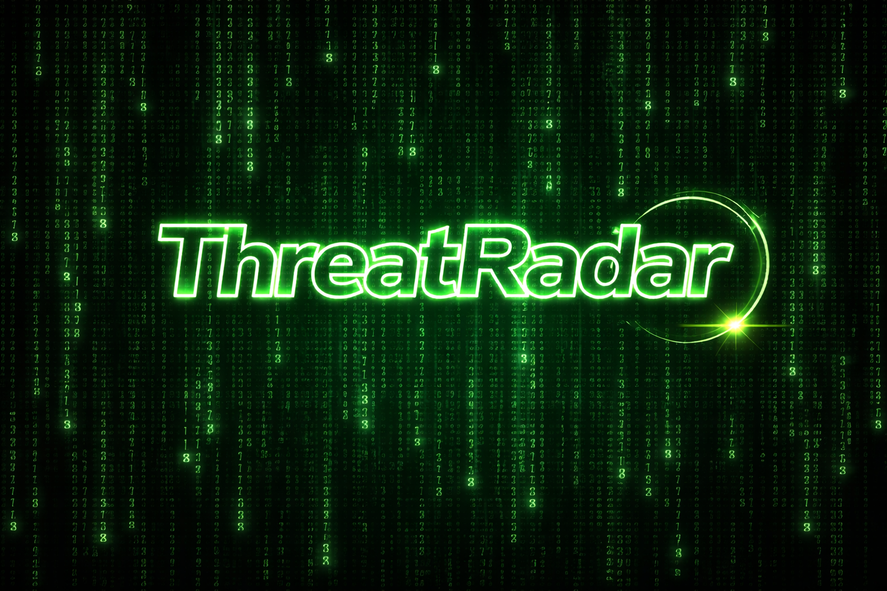

<!-- ====== Banner Section ====== -->
<p align="center">
  
</p>

<h1 align="center" style="margin-top: -12px;">ThreatRadar</h1>
<p align="center" style="font-size: 1.2rem; color: #80ff80;">Network Threat Monitoring & Pentest Tool</p>

<!-- ====== Badges Section ====== -->
<p align="center">
  <a href="https://www.python.org/downloads/">
    
  </a>
  
  <a href="LICENSE">
    
  </a>
</p>

---

## 🌟 Overview

**ThreatRadar** — это профессиональная система мониторинга сетевых угроз и анализа трафика, разработанная на Python.  
Проект объединяет перехват пакетов, анализ аномалий, оценку рисков и визуализацию сети в удобном интерфейсе.  

- Захват пакетов в реальном времени (Scapy)  
- Анализ угроз и классификация рисков  
- Визуализация сети и интерактивный дашборд (Flask)  
- Экспорт отчетов в JSON/TXT  
- Поддержка английского и русского языков интерфейса  

---

## 🛡️ Features

- **Packet Sniffer:** Захват TCP/UDP пакетов с записью логов  
- **Anomaly Detector:** Анализ на SYN Flood, Port Scanning и другие атаки  
- **Threat Classifier:** Оценка риска (Risk Score 0-100) и рекомендации  
- **Report Generator:** Красивые таблицы через `rich`, автоматическое сохранение  
- **Visualizer:** Веб-интерфейс + граф сети с подсветкой атакующих узлов  
- **Configuration:** Настройка порогов, путей к логам и форматов отчетов  

---

## ⚙️ Requirements & Installation

1. **Установите Python 3.10+**  
2. **Установите зависимости проекта:**  

```bash
git clone https://github.com/attent10nc/ThreatRadar.git
cd ThreatRadar
python -m venv venv          # Создаем виртуальное окружение (опционально)
# Активируем окружение
# Windows
venv\Scripts\activate
# Linux/macOS
source venv/bin/activate

pip install -r requirements.txt
```

Установите Nmap (обязательно для анализа портов)
-Windows: nmap.org/download.html
-Linux: sudo apt-get install nmap
-macOS: brew install nmap

🚀 Usage
Interactive Mode (рекомендуется)
python main.py

Выберите язык, IP-адрес цели, режим сканирования и формат отчетов.

CLI Mode
python main.py <TARGET_IP> [OPTIONS]

Опции:

-m, --mode — режим сканирования (fast, full, aggressive, vuln, pentest, dos_check)
-o, --output — имя файла отчета (JSON/TXT)
-l, --lang — язык интерфейса (en / ru)

Примеры:

FAST - python main.py 192.168.1.1 -m fast -l ru
HARD - python main.py 10.0.0.5 -m pentest -o audit_results

📊 Visualization
Веб-дашборд с графиком сети
Круговые диаграммы распределения протоколов
Топ активных и атакующих IP

⚠️ Legal Disclaimer
Использовать ThreatRadar только для легального аудита сети и тестирования собственных систем.
Автор не несет ответственности за незаконное использование.

🤝 Contributing
Любые предложения, исправления и новые фичи приветствуются.
Открывайте issue для багов и идей
Делайте fork проекта и отправляйте pull request

🌍 Supported Languages
        Russian
<p align="center" style="font-size:0.9rem; color:#555;"> © 2026 ThreatRadar — Network Threat Monitoring Tool </p> ```
